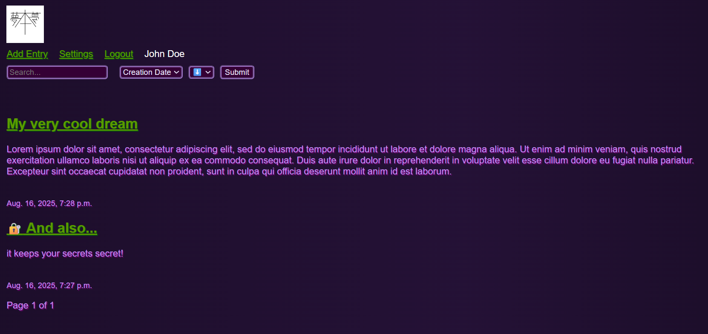
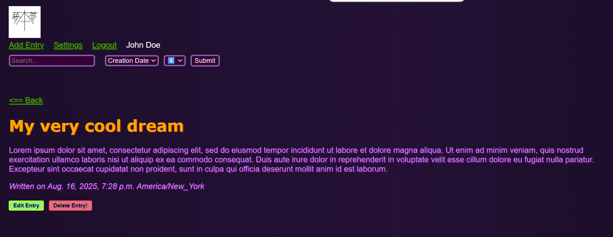
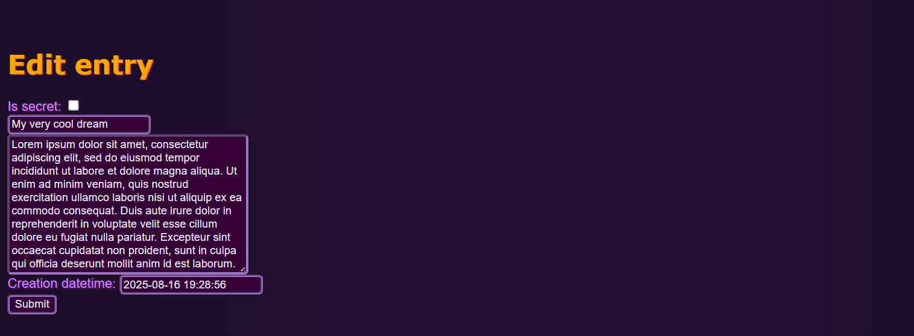

# Dream Journal Application

*The logo combines the Japanese character for book (本) with the word for dream (夢).*

## What it is
This is a Django web application designed to help users record and organize dream journal entries. This app was designed with the goals of privacy and simplicity in mind. This application supports multiple users with access control to prevent unauthorized access to other users' entries, and both exporting and importing of JSON backup files are supported.

*Please note that this application was primarily designed to be self-hosted on a private network, and is not intended to be exposed to the public internet.  Usage of a VPN is recommended to access this application remotely.*

## Features
- Multi-user authentication and access control
- Markdown support for basic formatting in entries
- JSON import/export functionality
- Ability to sort entries by creation date, word count, or last update time

## Security features
- Django CSRF protection enabled on all forms
- User passwords are stored in hashed format using Django's built in authentication system
- Automatic sanitization of user input using `bleach` to prevent XSS attacks

## What I learned
Through this project I gained hands-on experience using the Django library in Python to create a simple web application which incorporates features such as access control, input sanitization, and database management.

## Additional screenshots
### Entry details page


### Add/edit entry page



## Running the application
### Dependencies
All of the following packages can be installed below using `pip`:
- Django
- markdown
- markdownify
- bleach

`pip install django markdown markdownify bleach`

### Execution
```bash
cd <project_dir>
python3 ./manage.py runserver 0.0.0.0:8000
```
*0.0.0.0:8000 can be replaced with any listening IP/port combination.*
